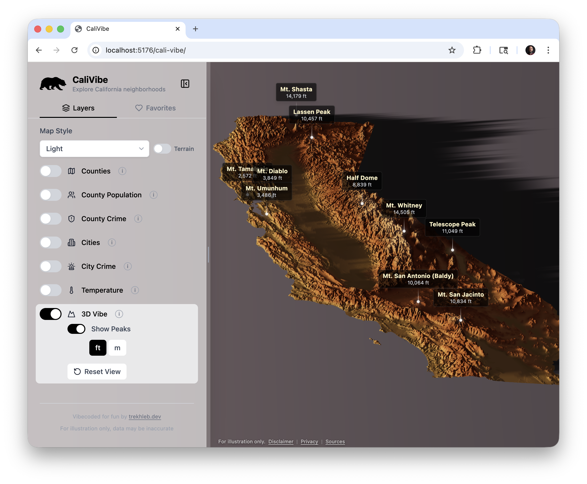
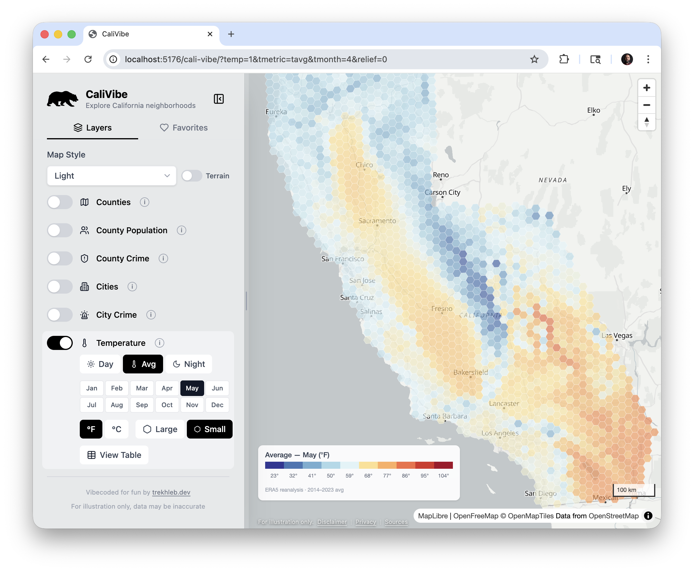
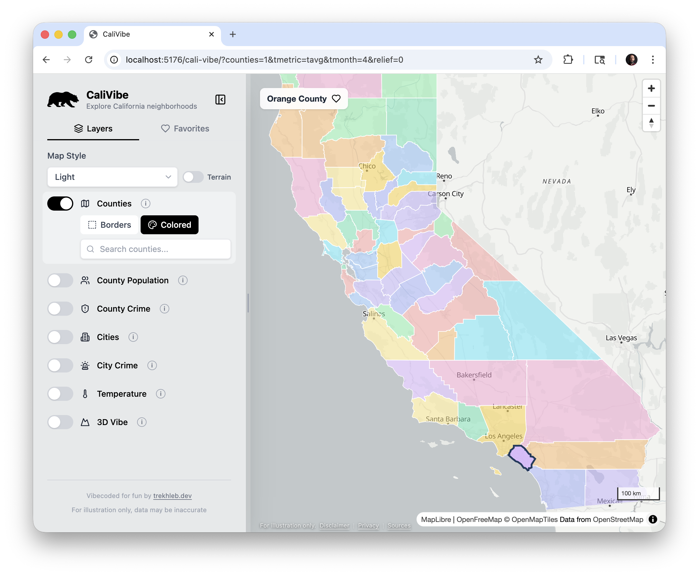
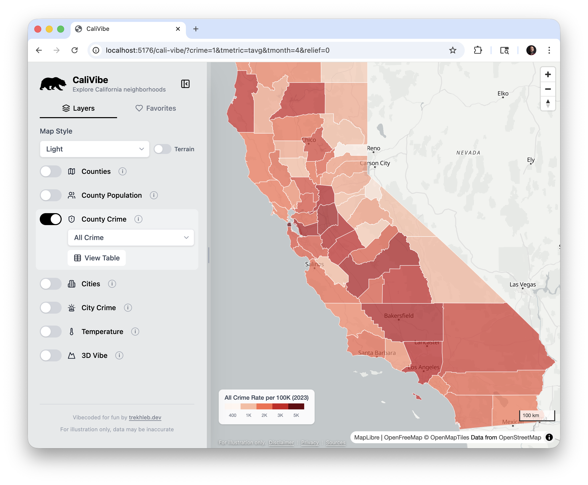

# CaliVibe

🔗 [trekhleb.dev/cali-vibe](https://trekhleb.dev/cali-vibe)

> Interactive map for exploring California counties and cities — population, crime rates, temperature, 3D terrain, etc.

Vibecoded for fun: `~98%` of the code was written by `Claude Code Opus` with a few sprinkles from `Gemini 3.1 Pro`.

## Why

Researching California neighborhoods usually means jumping between Census tables, DOJ crime reports, and climate databases. Vibecoded CaliVibe puts it all on a single interactive map so you can compare counties and cities without switching between tabs.

## What you can explore

- **Population** — 2024 estimates for every county, color-coded by density
- **Crime** — 10 metrics (violent, property, homicide, etc.) per 100K population for counties and cities (2023 DOJ data)
- **Temperature** — Monthly average highs, lows, and means on an H3 hex grid (10-year normals, °F/°C)
- **3D Terrain** — Rotatable raised-relief view with labeled mountain peaks (ft/m)
- **Favorites** — Save and reorder locations; drag-and-drop list persisted in local storage
- **Shareable state** — Every setting is encoded in the URL, so you can bookmark or share exact views

## Data sources

| Layer | Source |
|---|---|
| County boundaries | [CA Open Data Portal](https://data.ca.gov/dataset/ca-geographic-boundaries) / US Census TIGER/Line (2023) |
| City boundaries | [US Census Bureau TIGER/Line](https://www.census.gov/geographies/mapping-files/time-series/geo/tiger-line-file.html) (2024) |
| Population | [CA Dept. of Finance](https://dof.ca.gov/forecasting/demographics/estimates-e1/) E-1 / E-6 (2024) |
| Crime | [CA DOJ OpenJustice](https://openjustice.doj.ca.gov/data) (2023) |
| Temperature | [ERA5 Reanalysis](https://www.ecmwf.int/en/forecasts/dataset/ecmwf-reanalysis-v5) via [Open-Meteo](https://open-meteo.com/) (2014-2023) |
| Elevation | [AWS Terrain Tiles](https://registry.opendata.aws/terrain-tiles/) |

---

*For informational and illustrative purposes only. Data may be inaccurate.*
