# CaliVibe — Interactive California Map

> Explore and compare California counties and cities on a single interactive map: housing costs, income, education, race/ethnicity, age distribution, poverty, crime rates, population, temperature, sunshine hours, transit routes, and 3D terrain.

**[Open the live map: Compare California counties and cities](https://trekhleb.dev/cali-vibe)**

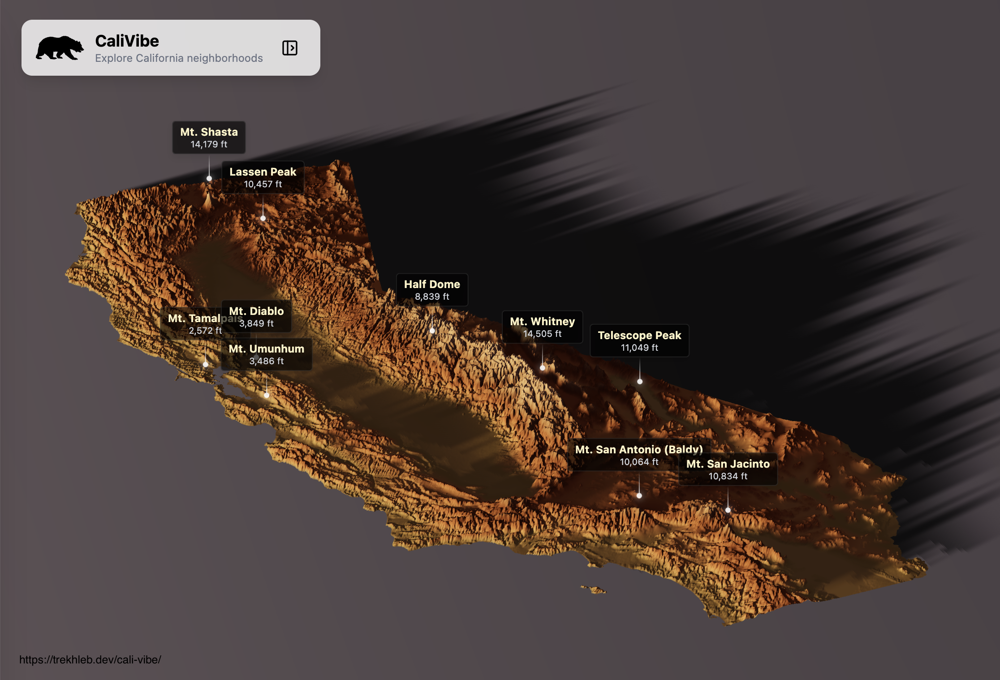

## Why

Researching California neighborhoods usually means jumping between Census tables, DOJ crime reports, climate databases, and transit schedules. CaliVibe puts it all on a single interactive map so you can compare counties and cities side-by-side without switching tabs.

## What you can explore

▶️ [Demo on YouTube](https://www.youtube.com/watch?v=1hLrH-K0fII)

### Compare counties and cities

Compare any California counties or cities side by side across all metrics — population, crime, housing, income, education, race/ethnicity, age distribution, and poverty. Color-coded cells highlight the best and worst values. Sortable columns, drag-to-reorder, and shareable via URL.

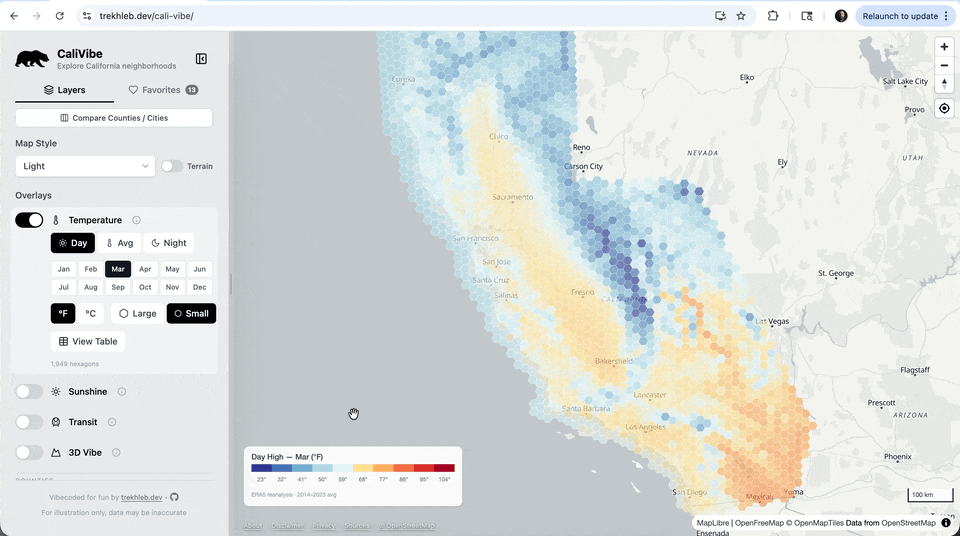

### Housing cost by county

Median home value and median gross rent for all 58 California counties, based on US Census Bureau ACS 5-year estimates (2019–2023). Choropleth color scale, sortable data table, hover to see exact values.

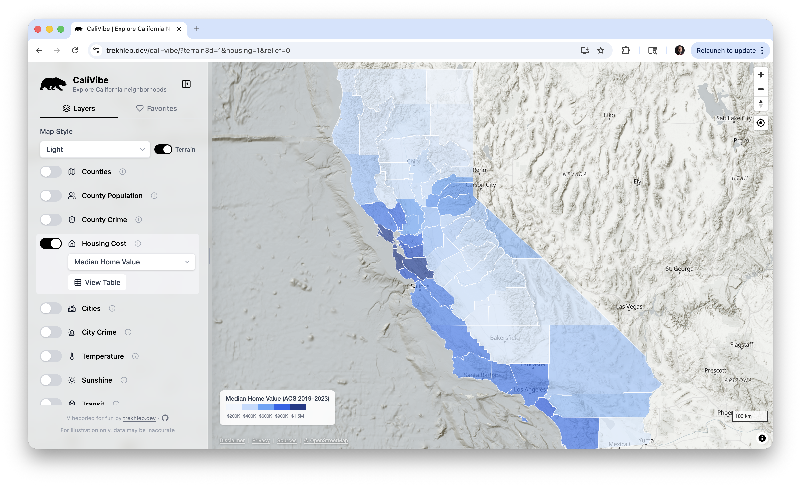

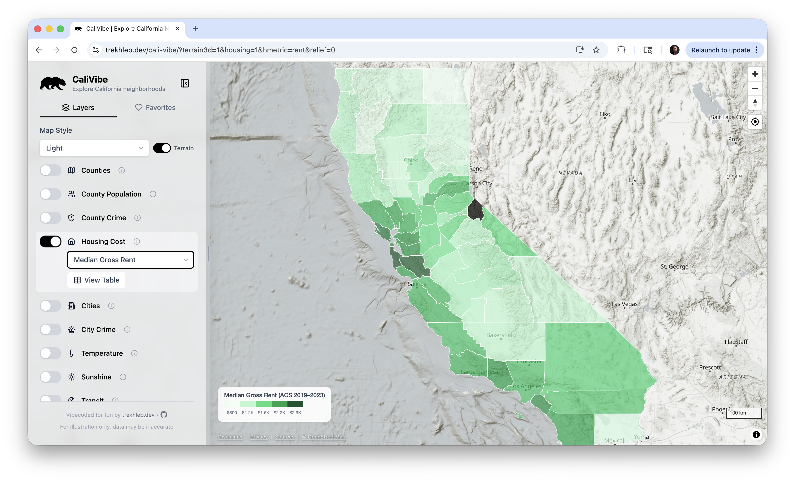

### Crime rates by county and city

10 crime categories (violent, property, homicide, robbery, burglary, motor vehicle theft, and more) per 100,000 residents. Data from CA DOJ OpenJustice 2023 report. Sortable table view with absolute and per-capita modes.

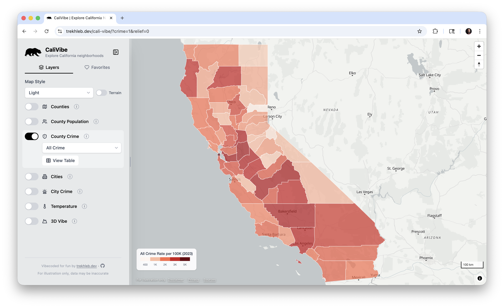

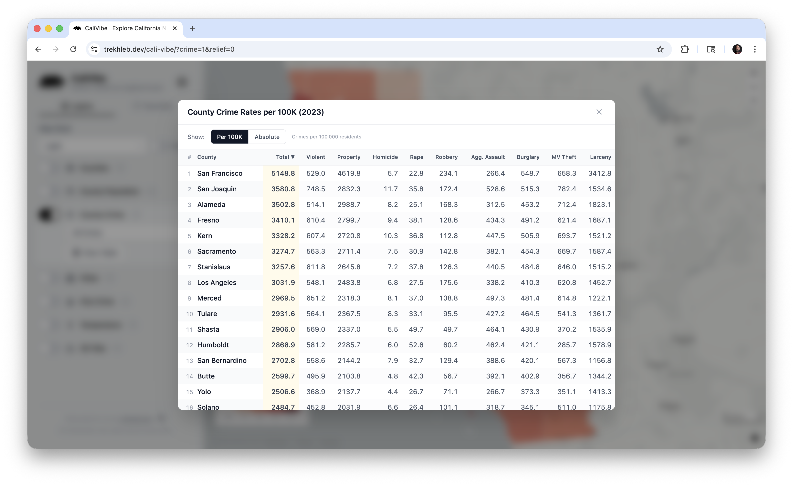

### Population by county

2024 population estimates for every county, color-coded choropleth with sortable data table. Source: CA Department of Finance E-6 estimates.

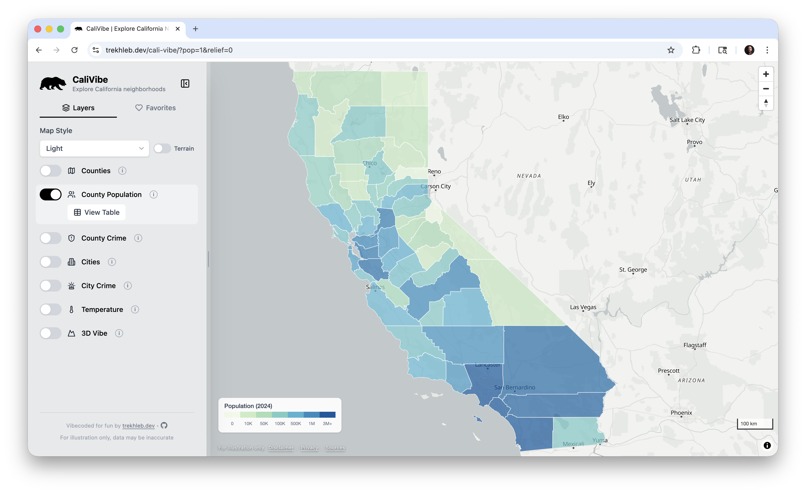

### Temperature map

Monthly average high, low, and mean temperatures on an H3 hexagonal grid. 10-year normals (2014–2023) in Fahrenheit or Celsius. Two grid resolutions available.

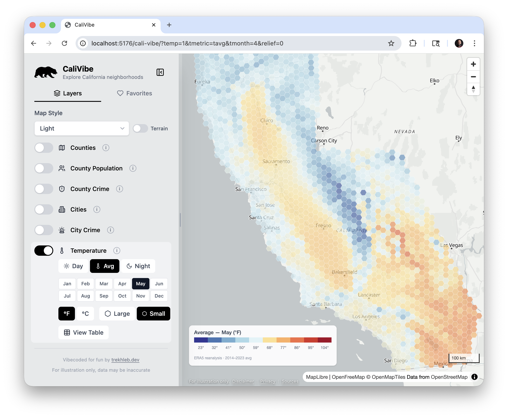

### Sunshine hours

Average daily sunshine hours by month for every part of California. Satellite-derived data (NREL NSRDB) and reanalysis data (ERA5) on an H3 hex grid. Great for comparing coastal fog vs. inland sun.

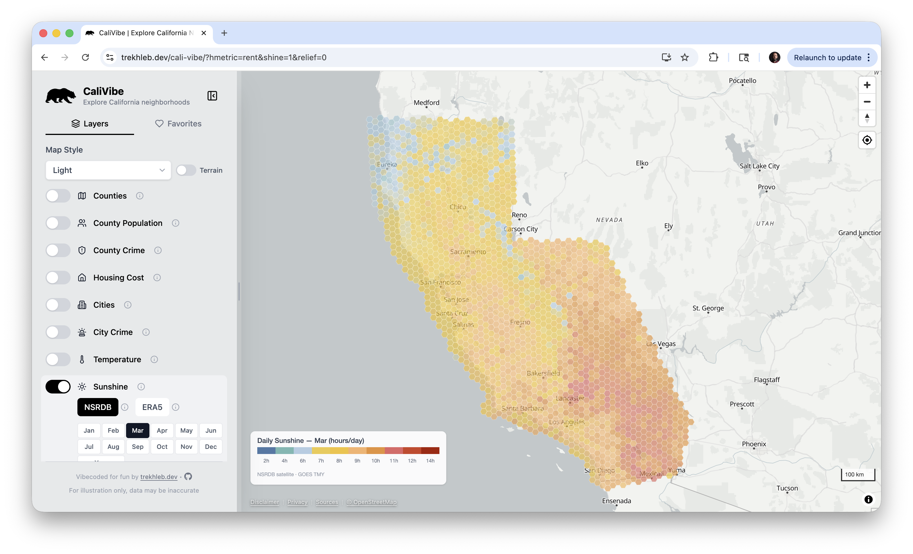

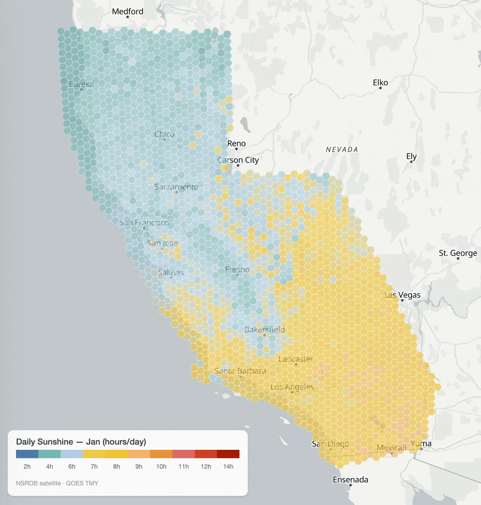

### Transit map — 18 rail systems

Routes and stations for all major California rail and light rail systems: BART, Caltrain, LA Metro, Muni Metro, VTA, SMART, Metrolink, San Diego Trolley, Coaster, Sprinter, Sacramento RT, ACE, and 6 Amtrak routes (Capitol Corridor, Pacific Surfliner, San Joaquins, Coast Starlight, California Zephyr, Southwest Chief). Toggle individual lines, search stations by name.

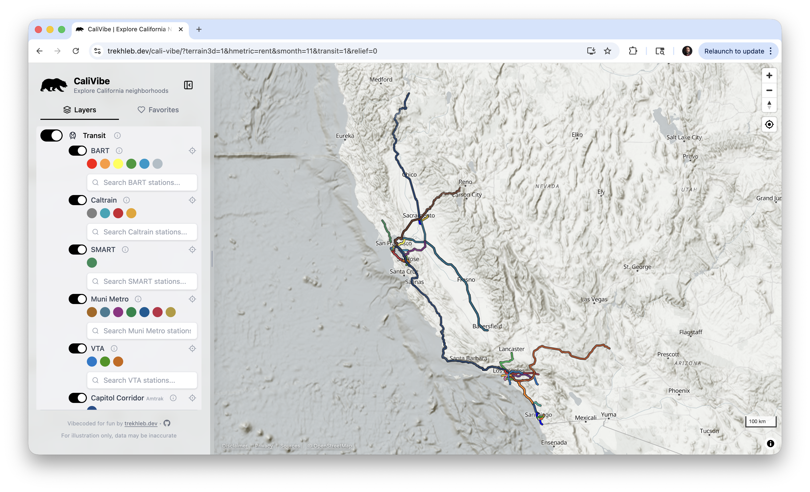

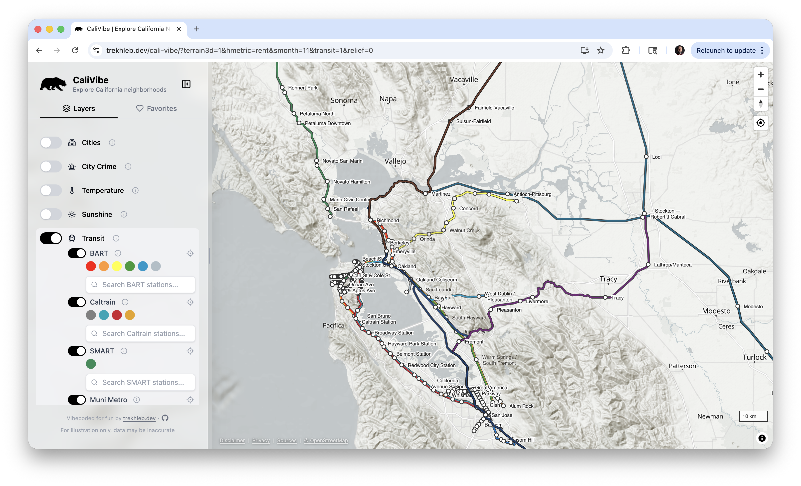

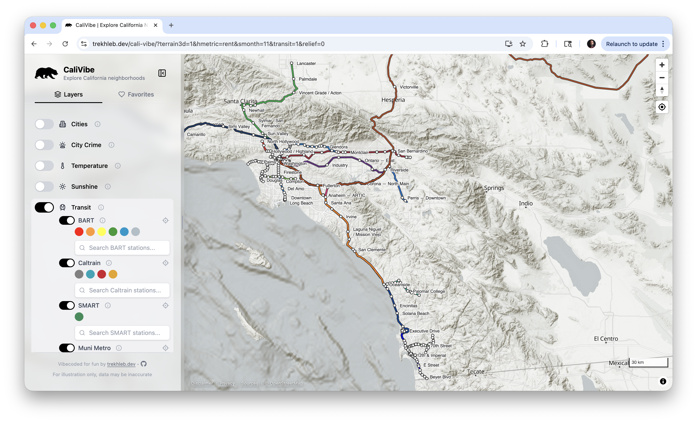

### County and city boundaries

All 58 California counties and 697 places (482 cities + 215 CDPs) with color-coded or outline borders.

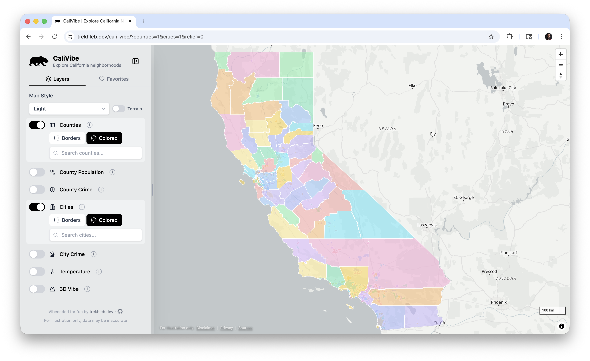

### 3D terrain

Rotatable raised-relief view of California with labeled mountain peaks (feet or meters). Mt. Whitney, Mt. Shasta, Half Dome, and more.

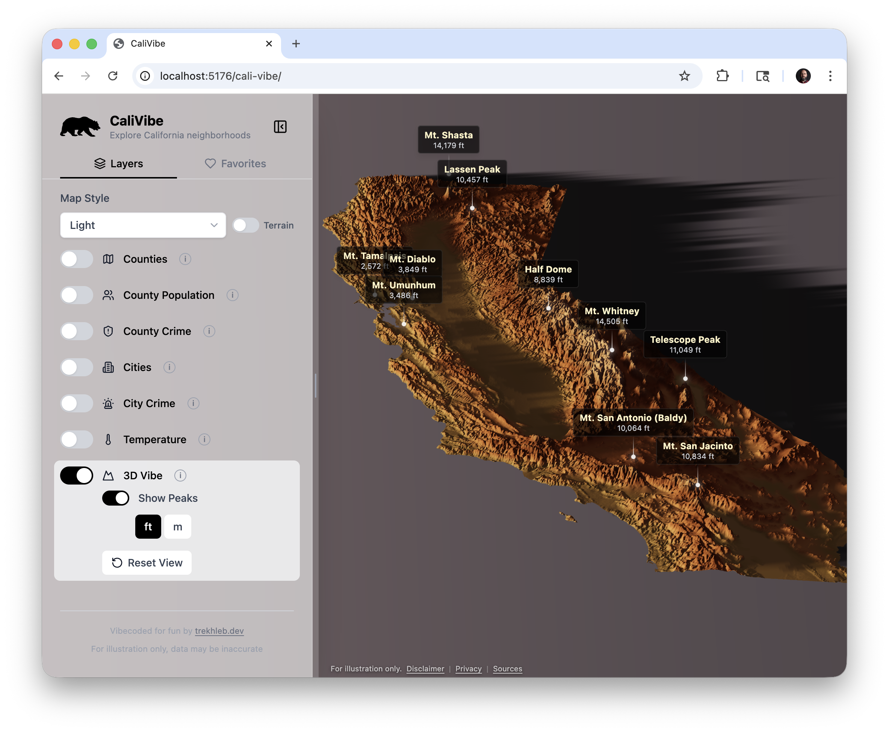

### Other features

- **Compare** — compare any counties or cities side by side across all metrics (including age distribution) with color-coded rankings, shareable via URL
- **Favorites** — save and reorder locations with drag-and-drop, persisted in local storage
- **Shareable state** — every toggle, metric, comparison, and view is encoded in the URL so you can bookmark or share exact map views
- **Mobile-friendly** — responsive layout with collapsible sidebar

## Tech stack

React, TypeScript, Vite, MapLibre GL JS, Tailwind CSS. H3 hexagonal grid for climate data. Playwright for visual regression testing. Deployed on GitHub Pages.

## Data sources

| Layer | Source | Year |
|---|---|---|
| Age distribution | [US Census Bureau ACS](https://data.census.gov/) — B01001, B01002 | 2019–2023 |
| Housing cost | [US Census Bureau ACS](https://data.census.gov/) — B25077, B25064 | 2019–2023 |
| County crime | [CA DOJ OpenJustice](https://openjustice.doj.ca.gov/data) | 2023 |
| City crime | [CA DOJ OpenJustice](https://openjustice.doj.ca.gov/data) | 2023 |
| Population | [CA Dept. of Finance](https://dof.ca.gov/forecasting/demographics/estimates-e1/) E-1 / E-6 | 2024 |
| Temperature | [ERA5 Reanalysis](https://www.ecmwf.int/en/forecasts/dataset/ecmwf-reanalysis-v5) via [Open-Meteo](https://open-meteo.com/) | 2014–2023 |
| Sunshine | [NSRDB GOES TMY](https://nsrdb.nrel.gov/) (NREL) / ERA5 | 2014–2023 |
| County boundaries | [CA Open Data Portal](https://data.ca.gov/dataset/ca-geographic-boundaries) / US Census TIGER/Line | 2023 |
| City boundaries | [US Census Bureau TIGER/Line](https://www.census.gov/geographies/mapping-files/time-series/geo/tiger-line-file.html) | 2024 |
| Transit (BART, Caltrain, etc.) | GTFS feeds from each agency | 2024–2025 |
| Elevation / 3D terrain | [AWS Terrain Tiles](https://registry.opendata.aws/terrain-tiles/) | — |
| Map tiles | [MapLibre GL JS](https://maplibre.org/) with [OpenStreetMap](https://www.openstreetmap.org/copyright) data | — |

## Vibe-coded

~98% of the code was written by Claude Code (Opus) with a few sprinkles from Gemini 2.5 Pro.

---

*For informational and educational purposes only. Data may be incomplete or inaccurate. Do not make decisions based solely on the information presented here.*
